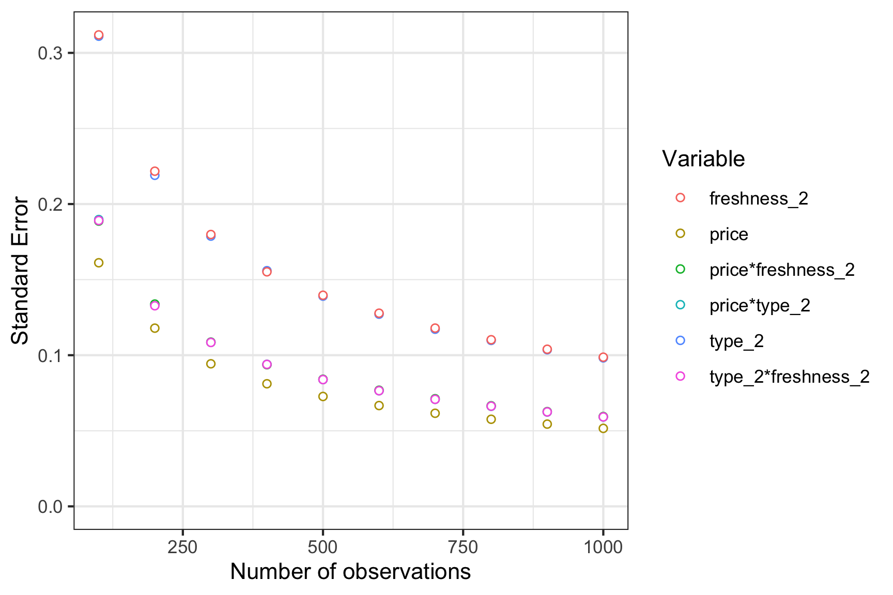

<!-- README.md is generated from README.Rmd. Please edit that file -->

# conjointTools

<!-- badges: start -->

[](https://www.tidyverse.org/lifecycle/#experimental)
[](https://CRAN.R-project.org/package=conjointTools)
<!-- badges: end -->

This package contains tools for designing choice based conjoint survey
experiments.

## Installation

The current version is not yet on CRAN, but you can install it from
Github using the **devtools** library:

``` r
devtools::install_github("jhelvy/conjointTools")
```

Load the library with:

``` r
library(conjointTools)
```

## Make experiment designs

Use the `makeDoe()` function to create a design of experiment

Generate a full factorial design of experiment with three attributes,
each with 2 levels:

``` r
doe <- makeDoe(levels = c(2, 2, 2))
doe
#>   X1 X2 X3
#> 1  1  1  1
#> 2  2  1  1
#> 3  1  2  1
#> 4  2  2  1
#> 5  1  1  2
#> 6  2  1  2
#> 7  1  2  2
#> 8  2  2  2
```

You can also give your variables names based on the attributes. Here is
an example of a full factorial design of experiment about apples:

``` r
doe <- makeDoe(
    levels = c(2, 2, 2),
    varNames = c("price", "type", "freshness")
)
doe
#>   price type freshness
#> 1     1    1         1
#> 2     2    1         1
#> 3     1    2         1
#> 4     2    2         1
#> 5     1    1         2
#> 6     2    1         2
#> 7     1    2         2
#> 8     2    2         2
```

The `makeDoe()` function can also generate “D”, “A”, and “I” optimal
fractional factorial designs:

``` r
doe <- makeDoe(
    levels = c(2, 2, 2),
    varNames = c("price", "type", "freshness"),
    type = "D",
    nTrials = 4
)
doe
#>   price type freshness
#> 1     2    1         1
#> 2     1    2         1
#> 3     1    1         2
#> 4     2    2         2
```

## Make coded survey designs

Once a design of experiment has been generated, a survey can be
generated by sampling from the design. The design eliminates the
possibility of duplicate alternatives appearing in the same choice
question.

``` r
survey <- makeSurvey(
    doe       = doe,  # Design of experiment
    nResp     = 1000, # Total number of respondents (upper bound)
    nAltsPerQ = 3,    # Number of alternatives per question
    nQPerResp = 6     # Number of questions per respondent
)

dim(survey)
#> [1] 18000     7
head(survey)
#>   respID qID altID obsID price type freshness
#> 1      1   1     1     1     2    2         2
#> 2      1   1     2     1     1    2         1
#> 3      1   1     3     1     1    1         1
#> 4      1   2     1     2     1    1         2
#> 5      1   2     2     2     2    2         2
#> 6      1   2     3     2     1    2         1
```

The resulting data frame includes the following additional columns:

  - `respID`: Identifies each survey respondent.
  - `qID`: Identifies the choice question answered by the respondent.
  - `altID`:Identifies the alternative in any one choice observation.
  - `obsID`: Identifies each unique choice observation across all
    respondents.

## Assess required sample sizes

To evaluate the necessary sample size to achieve a certain amount of
precision about estimated model parameters, use the `sampleSizer()`
function with the survey data frame returned from the `makeSurvey()`
function. The function estimates a logit model on multiple subsets of
the `survey` data frame with increasing sample sizes determined by the
`nbreaks` argument:

``` r
results <- sampleSizer(
    survey   = survey,
    parNames = c('price', 'type', 'freshness'),
    parTypes = c('c', 'd', 'd'), # Set continuous vs. discrete variables
    interactions = TRUE, # Add interactions between each attribute
    nbreaks  = 10
)

# Preview results
head(results)
#>   size        se               coef
#> 1  100 0.1611530              price
#> 2  100 0.3110412             type_2
#> 3  100 0.3118941        freshness_2
#> 4  100 0.1897302       price*type_2
#> 5  100 0.1887158  price*freshness_2
#> 6  100 0.1891048 type_2*freshness_2
```

View a plot of the results

``` r
library(ggplot2)
ggplot(results) +
    geom_point(aes(x = size, y = se, color = coef),
               fill = "white", pch = 21) +
    scale_y_continuous(limits = c(0, NA)) +
    labs(x = 'Number of observations',
         y = 'Standard Error',
         color = "Variable") +
    theme_bw()
```



## Version and License Information

  - Date First Written: *October 23, 2020*
  - Most Recent Update: December 09 2020
  - License:
    [MIT](https://github.com/jhelvy/conjointTools/blob/master/LICENSE.md)
  - [Latest
    Release](https://github.com/jhelvy/conjointTools/releases/latest):
    0.0.2

## Citation Information

If you use this package for in a publication, we would greatly
appreciate it if you cited it - you can get a bibtex citation entry with
`citation("conjointTools")`:

``` r
citation("conjointTools")
#> 
#> To cite conjointTools in publications use:
#> 
#>   John Paul Helveston, Martin Lukac, Alberto Stefanelli (2020).
#>   conjointTools: Tools For Designing Conjoint Survey Experiments.
#> 
#> A BibTeX entry for LaTeX users is
#> 
#>   @Manual{,
#>     title = {conjointTools: Tools For Designing Conjoint Survey Experiments},
#>     author = {John Paul Helveston and Martin Lukac and Alberto Stefanelli},
#>     year = {2020},
#>     note = {R package version 0.0.2},
#>     url = {https://jhelvy.github.io/conjointTools/},
#>   }
```
