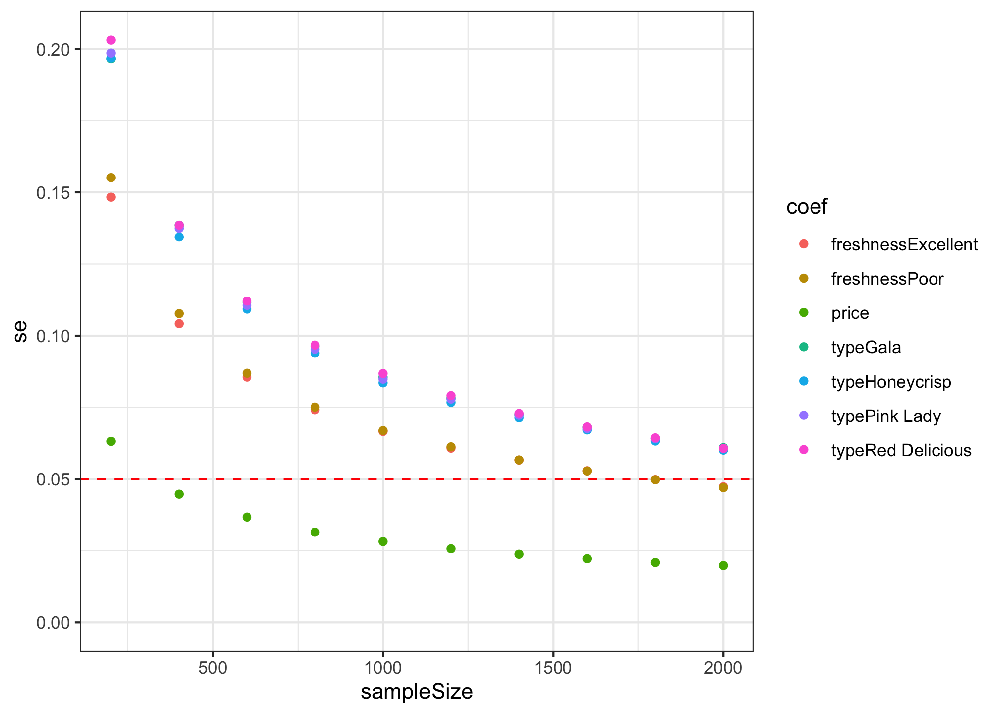

<!-- README.md is generated from README.Rmd. Please edit that file -->

# conjointTools

<!-- badges: start -->

[](https://CRAN.R-project.org/package=conjointTools)
<!-- badges: end -->

This package contains tools for designing surveys and conducting power
analyses for choice based conjoint survey experiments in R.

## Installation

The current version is not yet on CRAN, but you can install it from
Github using the {remotes} library:

``` r
# install.packages("remotes")
remotes::install_github("jhelvy/conjointTools")
```

Load the library with:

``` r
library("conjointTools")
```

## Make experiment designs

The first step in designing an experiment is to define the attributes
and levels for your experiment. Many of the functions in {conjointTools}
are more convenient to use if you define these as a separate object. For
example, let’s say you’re designing a conjoint experiment about apples.
You might have the following attributes and levels:

``` r
# Define the attributes and levels
levels <- list(
  price     = seq(1, 4, 0.5), # $ per pound
  type      = c('Fuji', 'Gala', 'Honeycrisp', 'Pink Lady', 'Red Delicious'),
  freshness = c('Excellent', 'Average', 'Poor')
)
```

With these levels defined, making the design of experiment is
straightforward using the `makeDoe()` function:

``` r
doe <- makeDoe(levels)
head(doe)
#>   price type freshness
#> 1     1    1         1
#> 2     2    1         1
#> 3     3    1         1
#> 4     4    1         1
#> 5     5    1         1
#> 6     6    1         1
```

You can also make an “optimized” fractional-factorial design based on
different criteria. For example, to make a “D-optimal” design, add the
`type = "D"` argument and specify the number of trials you want to use
from the full factorial design:

``` r
doe <- makeDoe(levels, type = "D", nTrials = 50)
#>   nTrials     d balanced
#> 1      50 0.893    FALSE
```

If you’re unsure of how many trials to use, you can set `search = TRUE`
to search across all feasible designs up to `nTrials` (with an optional
`minTrials` argument as a starting point):

``` r
doe <- makeDoe(levels, type = "D", nTrials = 50, search = TRUE, minTrials = 30)
#>    nTrials     d balanced
#> 16      45 0.916    FALSE
#> 13      42 0.901    FALSE
#> 14      43 0.896    FALSE
#> 17      46 0.894    FALSE
#> 21      50 0.893    FALSE
#> 6       35 0.891    FALSE
#> 7       36 0.884    FALSE
#> 15      44 0.878    FALSE
#> 18      47 0.878    FALSE
#> 20      49 0.876    FALSE
#> 19      48 0.859    FALSE
#> 8       37 0.857    FALSE
#> 9       38 0.853    FALSE
#> 10      39 0.835    FALSE
#> 11      40 0.815    FALSE
#> 12      41 0.798    FALSE
#> 1       30 0.733    FALSE
#> 2       31 0.729    FALSE
#> 3       32 0.711    FALSE
#> 4       33 0.693    FALSE
#> 5       34 0.675    FALSE
```

If using `search = TRUE`, the design with the highest D-efficiency is
returned.

You can also check the D-efficiency of any design using the
`evaluateDoe()` function:

``` r
evaluateDoe(doe)
#> $d_eff
#> [1] 0.916
#> 
#> $balanced
#> [1] FALSE
```

Once you’ve made your design, you can easily re-code it using the actual
labels in your `levels` object using `recodeDesign()`:

``` r
doe <- recodeDesign(doe, levels)

head(doe)
#>   price type freshness
#> 1   2.0 Fuji Excellent
#> 2   2.5 Fuji Excellent
#> 3   3.5 Fuji Excellent
#> 4   3.0 Gala Excellent
#> 5   3.5 Gala Excellent
#> 6   4.0 Gala Excellent
```

## Make conjoint surveys

A survey can be generated by randomly sampling from the design of
experiment. The `makeSurvey()` function also eliminates the possibility
of duplicate alternatives appearing in the same choice question:

``` r
survey <- makeSurvey(
    doe       = doe,  # Design of experiment
    nResp     = 2000, # Total number of respondents (upper bound)
    nAltsPerQ = 3,    # Number of alternatives per question
    nQPerResp = 6     # Number of questions per respondent
)

dim(survey)
#> [1] 36000     7
head(survey)
#>   respID qID altID obsID price          type freshness
#> 1      1   1     1     1   3.0          Gala   Average
#> 2      1   1     2     1   2.0    Honeycrisp      Poor
#> 3      1   1     3     1   3.5 Red Delicious   Average
#> 4      1   2     1     2   1.5          Fuji      Poor
#> 5      1   2     2     2   2.5 Red Delicious Excellent
#> 6      1   2     3     2   4.0    Honeycrisp   Average
```

The resulting data frame includes the following additional columns:

-   `respID`: Identifies each survey respondent.
-   `qID`: Identifies the choice question answered by the respondent.
-   `altID`:Identifies the alternative in any one choice observation.
-   `obsID`: Identifies each unique choice observation across all
    respondents.

## Simulate choices

You can simulate choices for a given `survey` using the
`simulateChoices()` function. By default, random choices are simulated:

``` r
data <- simulateChoices(
    survey = survey,
    obsID  = "obsID"
)
head(data)
#>   respID qID altID obsID price          type freshness choice
#> 1      1   1     1     1   3.0          Gala   Average      0
#> 2      1   1     2     1   2.0    Honeycrisp      Poor      1
#> 3      1   1     3     1   3.5 Red Delicious   Average      0
#> 4      1   2     1     2   1.5          Fuji      Poor      0
#> 5      1   2     2     2   2.5 Red Delicious Excellent      0
#> 6      1   2     3     2   4.0    Honeycrisp   Average      1
```

You can also pass a list of parameters to define a utility model that
will be used to simulate choices. In the example below, the choices are
simulated using a utility model with the following parameters:

-   1 continuous `price` parameter
-   4 discrete parameters for `type`
-   2 discrete parameters for `freshness`

``` r
data <- simulateChoices(
    survey = survey,
    obsID  = "obsID",
    pars = list(
        price     = 0.1,
        type      = c(0.1, 0.2, 0.3, 0.4),
        freshness = c(0.1, -0.1))
)
```

You can also simulate data with more complex models, such as mixed logit
models where parameters follow a normal or log-normal distribution
across the population, or interaction between parameters. In the example
below, the choices are simulated using a utility model with the
following parameters:

-   1 continuous “price” parameter
-   4 discrete parameters for “type”
-   2 random normal discrete parameters for “freshness”
-   2 interaction parameters between “price” and “freshness”

The `randN()` function is use to make the 2 `freshness` parameters
follow a normal distribution with a specified mean (`mu`) and standard
deviation (`sigma`).

``` r
data <- simulateChoices(
    survey = survey,
    obsID  = "obsID",
    pars = list(
        price     = 0.1,
        type      = c(0.1, 0.2, 0.3, 0.4),
        freshness = randN(mu = c(0.1, -0.1), sigma = c(1, 2)),
        `price*freshness` = c(1, 2))
)
```

## Conduct a power analysis

The simulated choice data can be used to conduct a power analysis by
estimating multiple models with different sample sizes. The
`estimateModels()` function achieves this by partitioning the simulated
choice data into multiple sizes (defined by the `nbreaks` argument) and
then estimating a user-defined choice model on each data subset. In the
example below, 10 different sample sizes are used to estimate 10 models.

``` r
models <- estimateModels(
    nbreaks = 10,
    data    = data,
    pars    = c("price", "type", "freshness"),
    outcome = "choice",
    obsID   = "obsID"
)
```

The resulting `models` object is a list of estimated models, each
estimated using the [{logitr}](https://jhelvy.github.io/logitr) package.

While the `models` object is a rather complex object in that it contains
multiple models, helper functions can be used to extract information of
interest. For example, the estimated coefficients and standard errors
from each model can be extracted using the `getModelResults()` function:

``` r
results <- getModelResults(models)

head(results)
#>   sampleSize               coef          est         se
#> 1        200              price  0.004714889 0.06315016
#> 2        200           typeGala  0.257165792 0.19652339
#> 3        200     typeHoneycrisp  0.236155900 0.19676697
#> 4        200      typePink Lady -0.044868360 0.19862169
#> 5        200  typeRed Delicious -0.015676909 0.20314139
#> 6        200 freshnessExcellent  0.280169823 0.14830753
```

Here is a summary of the standard errors for each sample size:

``` r
library(ggplot2)

ggplot(results) +
  geom_hline(yintercept = 0.05, color = "red", linetype = 2) +
  geom_point(aes(x = sampleSize, y = se, color = coef)) +
  expand_limits(y = 0) +
  theme_bw()
```



## Author, Version, and License Information

-   Author: *John Paul Helveston* <https://www.jhelvy.com/>
-   Date First Written: *October 23, 2020*
-   License:
    [MIT](https://github.com/jhelvy/conjointTools/blob/master/LICENSE.md)

## Citation Information

If you use this package for in a publication, I would greatly appreciate
it if you cited it - you can get the citation by typing
`citation("conjointTools")` into R:

``` r
citation("conjointTools")
#> 
#> To cite conjointTools in publications use:
#> 
#>   John Paul Helveston (2021). conjointTools: Tools For Designing
#>   Conjoint Survey Experiments.
#> 
#> A BibTeX entry for LaTeX users is
#> 
#>   @Manual{,
#>     title = {conjointTools: Tools For Designing Conjoint Survey Experiments},
#>     author = {John Paul Helveston},
#>     year = {2021},
#>     note = {R package version 0.0.8},
#>     url = {https://jhelvy.github.io/conjointTools/},
#>   }
```
